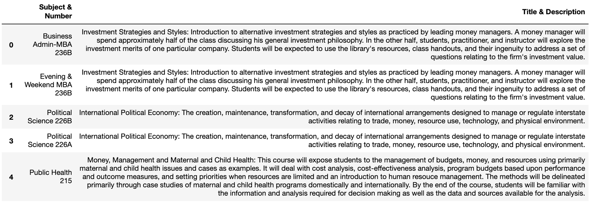
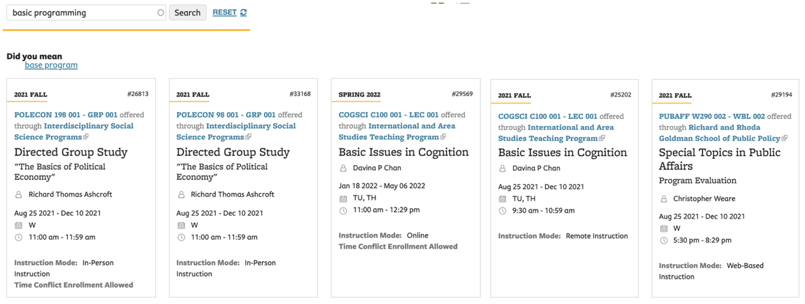

## A Course Search Feature with Different Document Representation Methods 
-- Weijie Jiang (Jenny), jiangwj[at]berkeley[dot]edu

This project tried to build a course search backend in the context of UC Berkeley with three traditional and modern document representation methods, including TF-IDF, BM25, and Sentence-BERT. The backend was implemented using Python3 and demonstrated in jupyter notebook. 

### Install required packages:
You can create a new anaconda virtual environment for running this project and install the requirement by running: 

* conda create -n [name]
* conda activate [name]
* pip install -r requirements.txt

### Data Preprocessing:
1. Go to the main directory and run: python [data\_preprocessing.py](https://github.com/fabulosa/Course_Search/blob/master/data_preprocessing.py), 
two files **course\_id.pkl** (dictionares for indexing courses) and **courseId\_description.json** (dictionary that maps course ID to course description) will be generated. 
2. Run python [tf-idf/data_preprocessing.py](https://github.com/fabulosa/Course_Search/blob/master/tf-idf/data_preprocessing.py), two files **tfidf.npy** (TF-IDF course description matrix) and **word_dict.json** (dictionary for indexing words) will be generated in folder [tf-idf](https://github.com/fabulosa/Course_Search/tree/master/tf-idf).
3. Run [sentence\_BERT/generate\_course\_embedding\_sentBert.py](https://github.com/fabulosa/Course_Search/blob/master/sentence_BERT/generate_course_embedding_sentBert.py), a file **course\_embeddings\_sentBert.npy** (sentence-BERT course description matrix) will be generated.

### Offline Evaluation:
The offline evaluation is a task to predict the most similar course to a given course, you will see the scores of Recall@10 and Mean/Median Rank for each method when running the following commands.

1. python [tf-idf/validation.py](https://github.com/fabulosa/Course_Search/blob/master/tf-idf/validation.py)
2. python [BM25/validation.py](https://github.com/fabulosa/Course_Search/blob/master/BM25/validation.py)
3. python [sentence_BERT/validation.py](https://github.com/fabulosa/Course_Search/blob/master/sentence_BERT/validation.py)

### Online Course Search:
Run each jupyter notebook below to experience the search feature hosted by each document representation method.

* TF-IDF backend: [tf-idf/query\_search\_tfidf.ipynb](https://github.com/fabulosa/Course_Search/blob/master/tf-idf/query_search_tfidf.ipynb)
* BM25 backend: [BM25/query\_search\_BM25.ipynb](https://github.com/fabulosa/Course_Search/blob/master/BM25/query_search_BM25.ipynb)
* Sentence_BERT backend: [sentence\_BERT/query\_search\_sentenceBert.ipynb](https://github.com/fabulosa/Course_Search/blob/master/sentence_BERT/query_search_sentenceBert.ipynb)

### Search Exemplars:
In order to examine the advantages and disadvantages of each method. Several representative examples are selected and analyzed in this section. The search result on the official website for class search at Berkeley https://classes.berkeley.edu/search/class/ were also compared with the methods implemented in this project.

#### Query 1: “how to manage money” 
This query is very colloquial, but a novice student might use it to search for courses related to finance and investment. The word “money” may be a synonym to some specialized words in course descriptions.     

**TF-IDF:** The top 5 results turned out not related to finance largely due to the fact that “manage” appear too many times in the course descriptions which dominates the relevance score. 

**BM25:** It is obvious that results got improved in that all the top 5 courses lie in the topic of investment strategies or money management. This example demonstrated the advantage of BM25 over TF-IDF in dealing with term saturation. We know the relevance score calculated by TF-IDF linearly increases with term frequency while for BM25 it grows fast first but then goes slowly. So BM25 is able to balance the relevance of each word in a query much better than TF-IDF when the frequencies of words in the query vary a lot.   

**Sentence-BERT:** Sentence-BERT learned condensed representation of courses and the query-document matching process is not based on term matching. It is apparent that the top 5 courses ranked by the model share more semantic similarity with the query “how to manage money” although sometimes the term “money” and “manage” do not show up in the course description. For example, in the first result, “investment”, “value assets”, “cash flows”, and “pricing risk” are all relevant to the query, but TF-IDF and BM25 could not retrieve it since none of them match any word in the query. 

**Official Website:** It seems the results returned from the official website were retrieved in a more naïve way of term match. But it tended to diversify the courses from different department, although none of them were from business school.

#### Query 2: “basic programming”

Students with non-technical majors may search for a course to learn basic programming. The stem of “programming” --“program” -- is also a homograph which has unrelated meanings, such as “an integrated course of academic studies” and “a sequence of instructions that a computer can interpret and execute”. “Basic” is also a homograph which could represent the meaning of “fundamental” and a high-level programming language “BASIC”.

**TF-IDF:** The search results include a combination of courses that contain the two different meanings of “program” (0, 1, 3 vs 2, 4). However, although the meaning of “program” in results 0, 1, 3 aligns with is meaning in the query, only result 0 (Information 206A) is a course that teaches basic programming. 

**BM25:** The search results demonstrated the two characteristics of BM25 in dealing with term saturation and document length. The results tended to achieve a balance between word “basic” and “program” and all the results have both the two words in their course descriptions, unlike the results generated by TF-IDF above that include many more occurrences of “programming / program” than “basic”. BM25 also assigns more weight to shorter document (b=0.75), so the length of course descriptions in the results are shorter than those resulted from TF-IDF on average. Similar to TF-IDF, BM25 cannot parse homograph which led to result 2 irrelevant to the query. But since BM25 balanced the two words in the query well, usually a course with description containing similar number of “basic” and “programming” is a fundamental programming course, which rendered the results slightly better than those retrieved by TF-IDF.

**Sentence-BERT:** The semantically meaningful document embeddings learned by Sentence-BERT could understand the query is about a basic programming course. All the results are courses that teach basic programming. Although Information 206A ranked the 6th, the top 5 results looked even more basic than that, such as Pascal programming and Symbolic programming. This example demonstrated the strength of Sentence-BERT in dealing with lexical relations (especially homography). 

**Official Website:** It seems all the results returned from the official website considered “program” as the meaning of “an integrated course of academic studies” instead of “programming language”.

#### Query 3: “a data science course which has low requirement for math”

This is a longer query that includes two disciplines, data science and math, and the polarity of data science is positive while negative for math. The query might be searched by students without a strong math background but are interested in learning data science. 

**TF-IDF:** For this query, TF-IDF returned very diverse results of data science courses from different department, such as Sociology, Geography, Data Science, Physics, and Global Studies. All the top 5 results do not contain “math” in their descriptions, which is probably due to the fact that word “data” or “data science” occur so many times in their descriptions that they dominated the relevance score to the query. This characteristic of TF-IDF actually contributes to its success in retrieving data science courses that has low requirement for math, because usually a more applied data science course tends to mention data or data science more frequently than math.

**BM25:** Opposite to TF-IDF, BM25 balanced the weight of each word in the query, therefore, the top 3 courses are all related to both math and data, which ended up being diverged from the original meaning of the query. 

**Sentence-BERT:** Although Sentence-BERT tends to perform better than traditional stream of bag-of-words methods in understanding the semantic meaning of a document, it seems it did not exhibit its strength in understanding this query. The top result Statistics 28 contains more mathematical elements than results 1, 2, 4, although it is a lower division course. The model might infer low requirement for math from the occurrence of “lower division”. However, result 3 is not a data science course at all, which implies the model did not quite penalize the occurrence of “math” in course descriptions by understanding the combination of “lower requirement” and “math”.   

**Official Website:** The results tended to fully orient towards data science without penalizing the occurrence of math-related words, such as probability and statistical. The results served as a sheer comparison to the results retrieved by the three methods above.

### Summary:

This project implemented a course search backend in the context of UC Berkeley with three document representation methods. TF-IDF and BM25 are two traditional bag-of-words based methods which represent a document with sparse features, while Sentence-BERT is a modern NLP model which represent a document with condensed features learned from a large volume of corpus and has demonstrated success in capturing complex semantic and lexical relationships in language. An offline evaluation on course similarity using the three types of course description representations showed that BM25 performed the best in retrieving the most similar course, although discrepancies among the three methods are very small. Online search results comparison and analysis substantiated the advantage and disadvantage of each method, which resonated with the design of each method. In general, TF-IDF tended to retrieve results that sometimes be dominated by a single word with a large number of occurrences, while BM25 was better at dealing with the term saturation problem and tended to favor documents of shorter length. Sentence-BERT demonstrated advantage over the other two methods of understanding certain level of semantic and lexical complexities, but failed in understanding some combination of words with different polarities. It is worth mentioning that none of the methods exhibited sheer superiority to the other methods, although they tended to retrieve more reasonable results than the official website in general. A combination of different document representation methods might be practical to be integrated to achieve further improvement in the retrieval results.   

